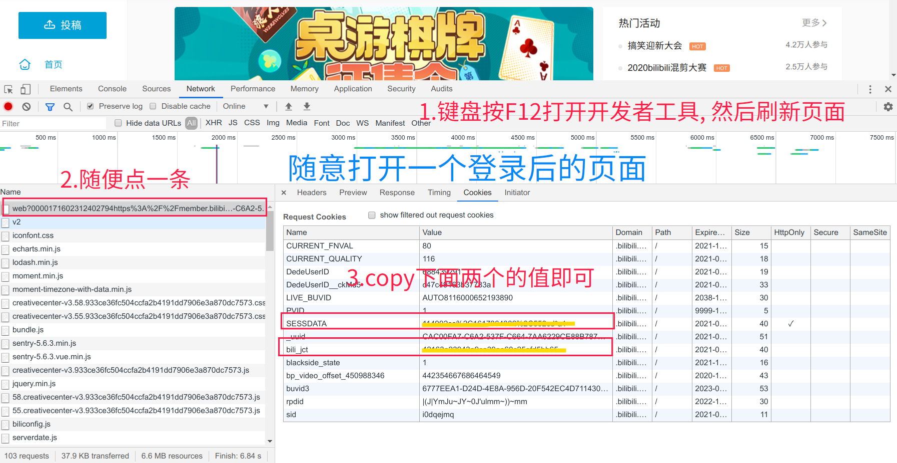
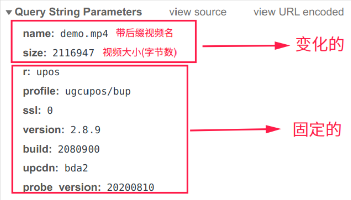
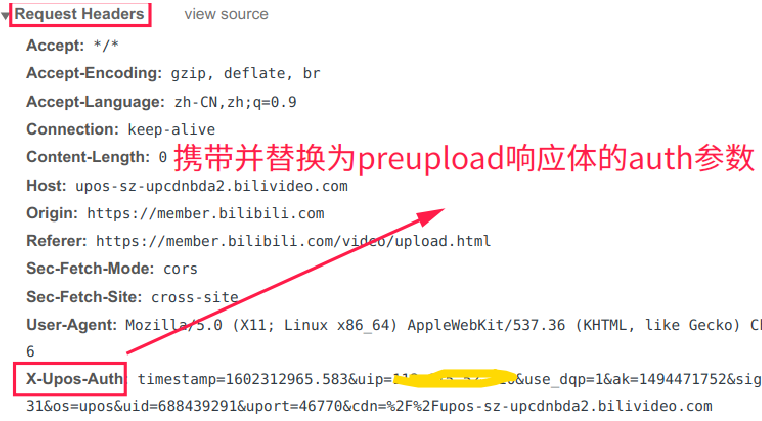
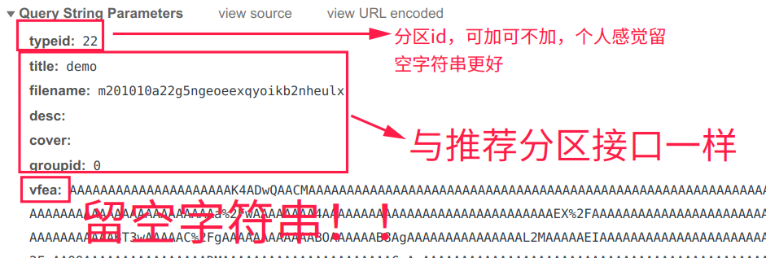
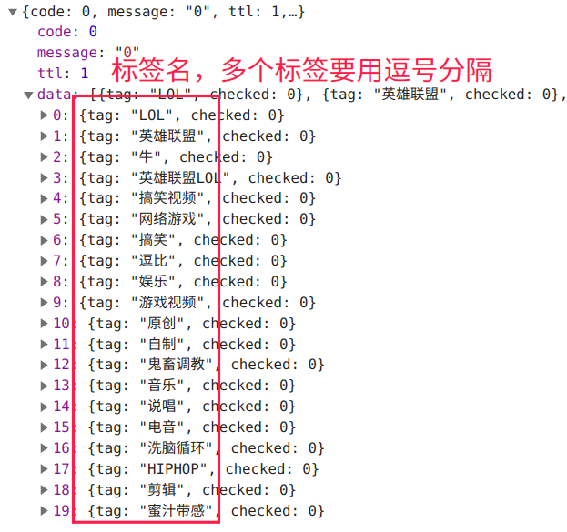
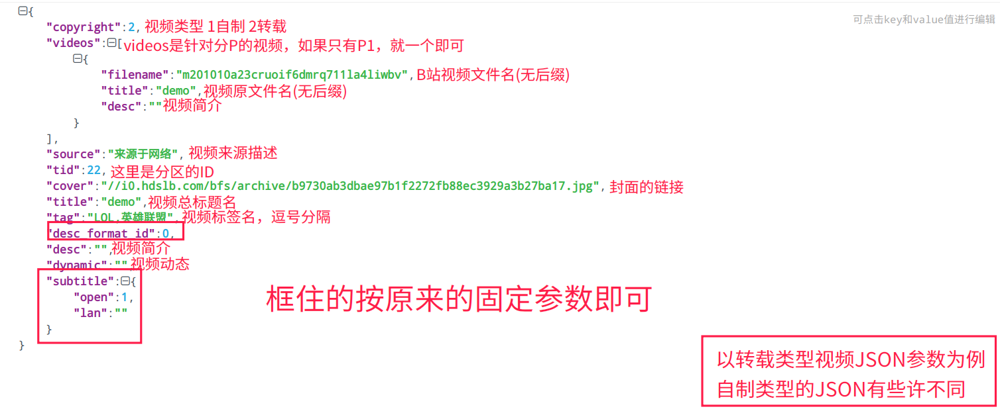

# B站视频发布接口分析

# 目录
- [获取登录Cookies](#获取登录cookies)
- [preupload预上传](#preupload预上传)
- [step1 准备上传视频](#step1-准备上传视频)
- [step2 分批上传视频](#step2-分批上传视频)
- [step3 通知上传完毕](#step3-通知上传完毕)
- [轮询获取视频封面](#轮询获取视频封面)
- [选择推荐分区](#选择推荐分区)
- [选择推荐标签](#选择推荐标签)
- [预发布](#预发布)
- [发布视频](#发布视频)
- [完整代码](#完整代码)

# 获取登录Cookies

请求要带着登录成功后关键Cookies，才能被B站后台认为是已登录的状态。

研究发现，以下两个是必要的:

1. SESSDATA(session会话cookies, 相当于登录凭证)
2. bili_jct(防CSRF攻击)

这两个都能在浏览器开发者工具(F12)中查看到，比如在**谷歌浏览器**中:

然后将这两个值复制下来，在接下来的请求中cookies带上这两个值即可保持登录状态

解决方案:

1. 可用`requests.Session.cookies = requests.utils.cookiejar_from_dict`设置Cookies，将在以后请求会话中保持
2. 可用`requests.Session.headers = {'User-Agent':'???'}`设置UA，将在以后请求会话中保持

# preupload预上传

**请求方法**: `GET`

**请求接口**: `https://member.bilibili.com/preupload`

**请求体**:

**响应体**:

**请求体解决方案**:

1. name参数可由`os.path.basename`或`pathlib.Path.name属性`获得
2. size参数可由`os.path.getsize`或`pathlib.Path.stat().st_size`获得

# step1 准备上传视频

**请求方法**: `POST`

**请求接口**: `https://upos-sz-upcdnbda2.bilivideo.com/[upos_uri]`

**替换上面`[upos_uri]`为`preupload预上传接口`响应体中`upos_uri`的`upos://`的后面部份，比如`https://upos-sz-upcdnbda2.bilivideo.com/ugcboss/m201010a23h35mci3cejzh2xe4a6gwq1.mp4`**

**请求头**:

**请求体**:

**响应体**:

# step2 分批上传视频

**重难点**

**请求方法**: `PUT`

**请求接口**: `同step1接口`

**请求头**: `同step1接口`

**请求体(分两个部份)**: 

**请求体解决方案**:

1. params参数通过`requests.put的params`参数传递，`payload`通过`requests.put的data`参数传递
2.  `chunks`总批次根据`preupload响应体中chunk_size`参数计算得出，通过`math.ceil(filesize/chunk_size)`向上取整。得到`chunks`后，在循环中改变`partNumber`、`chunk`两者
3.  内置函数`open`获得视频文件IO流。`read(size=chunk_size)`方法获得指定大小的视频字节，并通过内置函数`len`获得当前批次字节数`size`参数。`tell`方法获取当前字节位置，对应`start`与`end`参数
4. 在循环中改变`partNumber`、`chunk`、`chunks`、`size`、`start`和`end`参数
5. 将`read`读出的字节通过`requests.put的data`参数传递过去

# step3 通知上传完毕

**请求方法**: `POST`

**请求接口**: `同step1接口`

**请求头**: `同step1接口`

**请求体(分两个部份)**: 

**PS: 上图没有用框框住的参数，都是固定写死**

**请求体解决方案**:

json形式的请求体可以用`requests.post的json`参数传递

# 轮询获取视频封面

**请求方法**: `GET`

**请求接口**: `https://member.bilibili.com/x/web/archive/recovers?fns=[bfilename]`

注意把`[bfilename]`替换成在B站的视频文件名

**响应体**:

**解决方案**: 因为要等待B站后端处理好封面图片，所以这一步需要隔一段时间就访问一下该接口，直到响应体的`data`字段不是空列表时结束轮询

# 选择推荐分区

**请求方法**: `GET`

**请求接口**: `https://member.bilibili.com/x/web/archive/typeid`

**请求体**:

PS:

1. `groupid`不清楚干嘛用的, 目前遇到可以固定是0或1
2. `vfea`不清楚干嘛用的, 空字符串即可

**响应体**:

# 选择推荐标签

**请求方法**: `GET`

**请求接口**: `https://member.bilibili.com/x/web/archive/typeid`

**请求体**:

**响应体**:

PS: 可以用列表推导式将标签字符串存于列表中，再用字符串`join`方法用`英文逗号`拼接

# 预发布

**请求方法**: `GET`

**请求接口**: `https://member.bilibili.com/x/geetest/pre/add`

PS: 没啥好讲的, 直接`get`这个链接，它的响应体也没什么有用的东西

# 发布视频

经过前面的"过五关斩六将"，终于到了最后一步了

**请求方法**: `POST`

**请求接口**: `https://member.bilibili.com/x/vu/web/add?csrf=[bili_jct]`

**注意替换链接中`csrf`参数为`bili_jct`(一开始需要的两个Cookies的中其一), 替换`[bili_jct]`!**

请求体(JSON):

自制类型的视频请求体与上图有些许差别:

1. 因为source是只针对于转载类型视频的，所以自制类型视频不需要携带该参数
2. 新增interactive参数，取值0或1，貌似是跟允许观众投稿字幕有关
3. 新增no_reprint参数，取值0或1，貌似是跟自制声明有关
4. 最重要的是声明版权，改变copyright为1即可

# 完整代码

> Talk is cheap, Show me the code

戳它: <https://gitee.com/nbodyfun/bilibili_video_uploader/raw/master/bilibili_up.py>